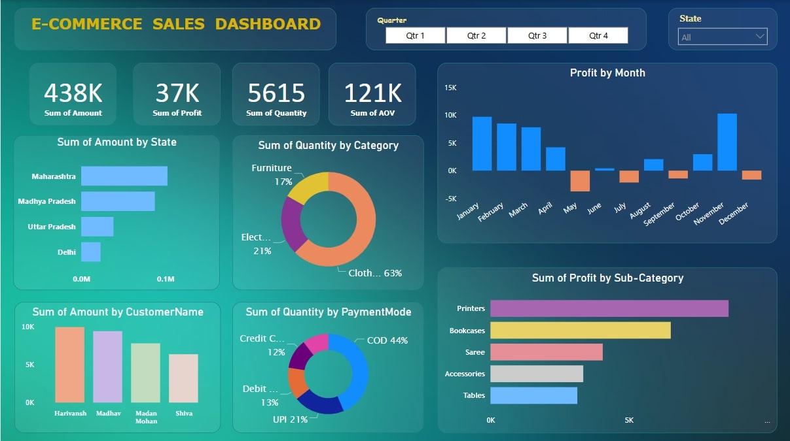

# 📊 E-Commerce Sales Dashboard 🚀  

The **E-Commerce Sales Dashboard** is a powerful analytical tool designed to provide actionable insights for businesses operating in the dynamic world of online sales. By visualizing complex data patterns, it enables stakeholders to make informed decisions that drive growth and enhance operational efficiency.  

---

## 🌟 Project Highlights  
This dashboard offers an end-to-end view of e-commerce sales, bringing clarity to various business dimensions:  

- **Business Performance Tracking:**  
   Analyze crucial KPIs such as total sales, profit, order volumes, and average order value (AOV) to assess business health.  

- **Regional Insights:**  
   Understand state-wise sales distribution to identify high-revenue regions and areas needing attention.  

- **Category & Product Analysis:**  
   Identify the best-performing product categories and sub-categories to make smarter inventory and marketing decisions.  

- **Payment Mode Preferences:**  
   Visualize customer payment preferences to optimize payment gateway partnerships and reduce transaction friction.  

- **Customer Segmentation:**  
   Track high-value customers and analyze purchasing patterns to foster loyalty and improve engagement strategies.  

- **Monthly Profit Trends:**  
   Detect seasonal variations and profit spikes to improve demand forecasting and resource allocation.  

---

## 📈 Data Storytelling Approach  
- **Clean and Interactive Visuals:** The dashboard employs pie charts, bar graphs, and KPI cards to deliver intuitive insights.  
- **Data Segmentation:** Metrics are broken down by state, category, and payment mode for focused analysis.  
- **Insightful Filters:** Explore sales data by quarterly and state-wise filters for granular insights.  

---

## 📊 Insights Uncovered  
1. **Top Performing States:** Maharashtra and Madhya Pradesh lead in overall sales volume.  
2. **Category Contribution:** Clothing dominates sales at 63%, followed by Electronics at 21%.  
3. **Payment Mode Insights:** Cash on Delivery (COD) remains the most preferred payment mode.  
4. **Seasonal Trends:** December shows a notable spike in profit, indicating potential year-end sales surges.  
5. **Customer Behavior:** High engagement from key customers boosts overall revenue streams.  

---

## 🌍 Business Value  
This dashboard empowers stakeholders with:  
- **Informed Decision-Making:** Make strategic moves based on real-time sales insights.  
- **Customer-Centric Strategies:** Tailor offerings based on regional and payment preferences.  
- **Improved Financial Planning:** Optimize operations by tracking seasonal trends and category performances.  

---

## 🔍 Potential Enhancements  
- Incorporate real-time data feeds for live updates.  
- Add predictive analytics to forecast sales trends.  
- Integrate customer feedback data for a holistic view of market dynamics.  

---

## ✨ Conclusion  
This dashboard encapsulates the power of analytics in transforming raw data into meaningful insights, helping businesses thrive in the competitive e-commerce landscape.  

Made with 💙 by **#ArunCooksData**

Feel free to reach out to me for any questions or collaboration opportunities.

## 🔗 Connect with me :
- **Linkedin**: [linkedin.com/in/arun](https://www.linkedin.com/in/arun-deep-04964b258/) 🌐
- **GitHub**: [github.com/ArunCooksData](https://github.com/ArunCooksData) 👨‍💻
- **Email**: [arundeepp9393@gmail.com](mailto:arundeepp9393@gmail.com) 📧
